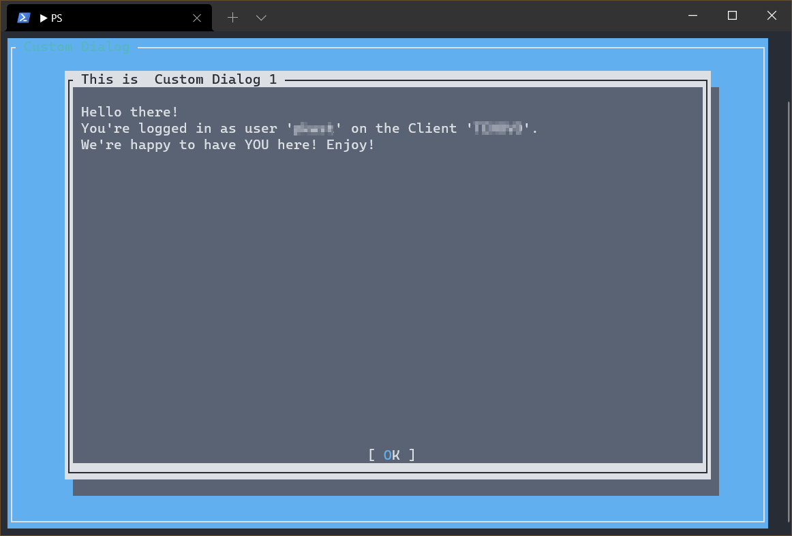
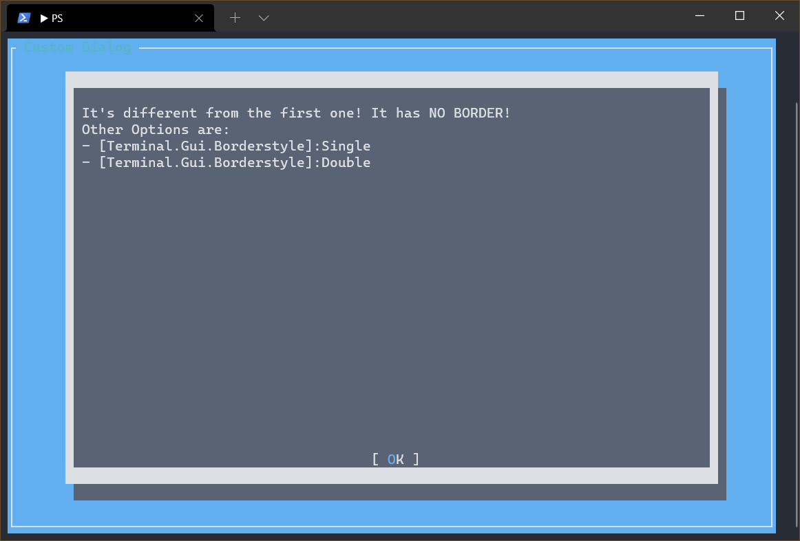
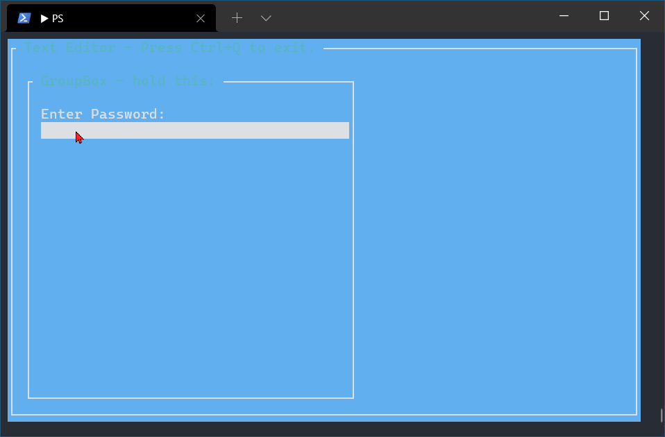
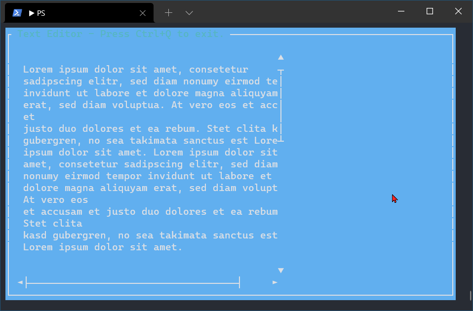
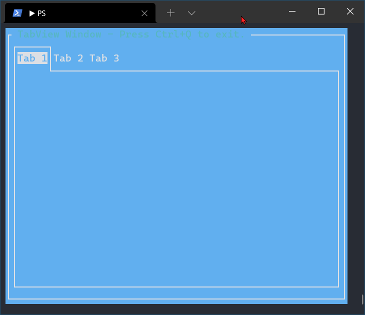
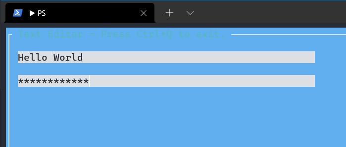

# PS-Terminal-GUI
Collection of little PowerShell-Scripts to show the usage of Miguel De Icaza's 'GUI.cs' Library for .NET.

## Installation

Get `NStack.dll`, `Terminal.Gui.dll` and `Terminal.Gui.xml` and import them in your Scripts.
For the examples I've used the same directory. So it's easy to ship the Modules/Libs with
your own script. Importing is carried out via 

```
Import-Module "$PSScriptRoot\NStack.dll" -ErrorAction Stop | Out-Null
Import-Module "$PSScriptRoot\Terminal.Gui.dll" -ErrorAction Stop | Out-Null
```

then. So no fixed paths are necessary.

## Note

Currently one might miss some GUI-components or their functionality. This is not a 100% coverage of everything
that Terminal.Gui.dll offers and might never be. However, I try to show as much functionality as possible, depending on
what comes to my mind or where I see fit.

## A word on the code structure

In the basic examples one may find quite stupid codes with repetition of lines to create several objects from the same class.
This is considered bad coding style. I know that. Normally one would use other strategies - such as loops - for sucht tasks.

However, I've decided against this as for newcomers who have to learn a new library/framework which also heavily relies on
interaction with other philosophies (C# .NET Framework vs. PowerShell in this case) may get confused even more, when
certain methologies are applied. 

This is really written with the beginner in mind. 

## Sources

Get the Libs from here:

https://github.com/migueldeicaza/NStack

https://github.com/migueldeicaza/gui.cs

## Screenshots






